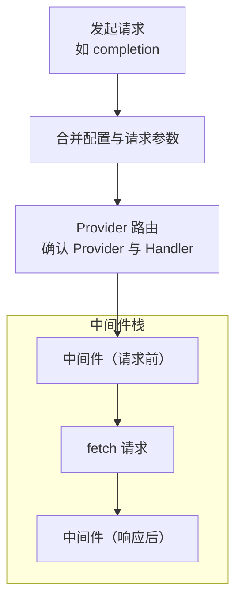

<div align="center">

# 🔌 ada-pter

**TypeScript 版的统一、类型安全的大模型适配层**

[](https://www.npmjs.com/package/@ada-pter/core)
[](https://codecov.io/gh/XLCYun/ada-pter)
[](https://github.com/XLCYun/ada-pter/actions/workflows/unit-tests.yml)
[](https://www.typescriptlang.org/)
[](https://bun.sh)
[](https://opensource.org/licenses/Apache-2.0)

[English](./README.md) | 简体中文

*如果这个项目对你有帮助，请考虑在 GitHub 上点个 ⭐ 支持我们！*

</div>

`ada-pter` 是一个受 litellm 启发的 TypeScript 实现，其核心是一个灵活的类 Koa 洋葱模型中间件引擎。它提供了一套统一的、跨平台的 API 来与多种大语言模型（LLM）供应商进行交互，同时保持了极简的核心，将特定供应商的逻辑以按需加载的插件形式提供。

## ✨ 核心特性

- 🔌 **框架 + 插件**：核心引擎极其轻量。你只需安装你实际需要的 LLM 供应商插件（例如 `@ada-pter/openai`）。
- 🧅 **洋葱模型中间件**：基于 Koa 式洋葱模型设计，使得核心精简且灵活，易于复用。每一次请求与响应都会流经整个中间件栈，方便拦截与处理。
- 🔀 **灵活的路由模式**：使用 `route` 路由模式来灵活地为不同的模型配置相应的供应商，并支持 `autoRoute` 自动路由。
- 🔄 **多供应商失败降级 (Fallback)**：支持配置多个模型，当请求失败时自动降级重试备用模型或供应商，保障高可用性。
- ⚙️ **四级配置体系**：采用高度灵活的四级配置体系（全局默认 -> Adapter级别 -> API级别 -> 请求级别）。
- 🛡️ **类型安全**：从零开始使用 TypeScript 构建，确保在所有 API 中提供出色的自动补全和严格的类型安全。
- ✅ **100% 测试覆盖率**：核心引擎与所有官方供应商插件均经过严格的单元测试，保障生产级的高可靠性。
- 🌍 **通用与零重度依赖**：核心包仅依赖原生 Web API（`Promise`、`AsyncIterable`、`fetch`、`AbortController`），无任何沉重的第三方依赖。
- 📡 **SSE 流式支持**：原生支持 Server-Sent Events (SSE) 流式响应，轻松处理实时流式输出。
- 🎯 **多模态支持**：提供统一的管道来处理文本补全 (Completions)、向量化 (Embeddings)、音频 (语音/转录) 以及图像生成。（更多供应商和 API 方法正在积极开发中，即将上线！）
- 🔁 **内置请求级重试控制器**：框架内置请求重试能力，支持指数退避与抖动 (jitter)、`Retry-After` 解析、最大退避时长限制等。
- ⏱️ **内置超时与 Signal 取消**：支持 `timeout` 与自定义 `signal`，并在运行时统一合并为单一取消信号传递到请求层。

## 📦 安装

安装核心包以及你所需的供应商插件。

```bash
# 使用 bun
bun add @ada-pter/core @ada-pter/openai

# 使用 npm
npm install @ada-pter/core @ada-pter/openai

# 使用 pnpm
pnpm add @ada-pter/core @ada-pter/openai

# 使用 yarn
yarn add @ada-pter/core @ada-pter/openai
```

## 🚀 快速开始

以下是一个极简示例，展示如何使用默认导出的 `adapter` 单例。它底层使用了 `autoRoute`，会自动根据你提供的模型名称，推断并加载所需的供应商插件（如 `@ada-pter/openai` 或兼容 OpenAI 格式的其他供应商）！

```typescript
import { adapter } from "@ada-pter/core";

// 发起统一的 API 调用 (自动使用推断出的供应商)
const response = await adapter.completion({
  model: "gpt-4o", // 你可以使用 "gpt-4o" 或 "openai/gpt-4o" 等
  messages: [{ role: "user", content: "你好，世界！" }],
});

console.log(response.choices[0].message.content);
```

### SSE 流式输出

```typescript
import { adapter } from "@ada-pter/core";

// 使用流式输出
const stream = await adapter.completion({
  model: "gpt-4o",
  messages: [{ role: "user", content: "写一首关于编程的诗" }],
  stream: true,
});

// 逐块处理流式响应
for await (const chunk of stream) {
  const content = chunk.choices[0]?.delta?.content;
  if (content) {
    process.stdout.write(content);
  }
}
```

## 🔄 自动 Fallback (失败降级)

当主模型请求失败时，`@ada-pter/core` 支持自动降级到备用模型，保障服务高可用性。

```typescript
import { adapter } from "@ada-pter/core";

// model 字段支持数组形式，按顺序尝试，前一个失败后自动降级到下一个
const response = await adapter.completion({
  model: ["gpt-5", "gpt-4o"],  // gpt-5 失败时，自动降级到 gpt-4o
  messages: [{ role: "user", content: "你好！" }],
});

console.log(response.choices[0].message.content);
```

## 🏗️ 架构设计

下面是 `ada-pter` 在一次请求（例如 `completion`）中的核心处理流程：



## 🔀 灵活的路由机制

`ada-pter` 使用路由系统将请求匹配到合适的供应商。你可以通过两种主要方式配置路由：

### 1. 基于条件的路由 (`route`)
将特定的条件映射到一个供应商实例。你可以通过 `provider` (供应商前缀)、`model` (去掉前缀后的模型名) 或 `modelId` (完整的 `provider/model` 字符串) 进行匹配。

```typescript
import { adapter } from "@ada-pter/core";
import { autoProvider as openAiProvider } from "@ada-pter/openai";

// 通过供应商前缀匹配 (例如捕获 "openai/gpt-4o")
adapter.route({ provider: "openai" }, openAiProvider);

// 通过去掉前缀后的模型名匹配 (例如捕获 "my-provider/gpt-4")
adapter.route({ model: "gpt-4" }, openAiProvider);

// 通过完整精确的 modelId 匹配
adapter.route({ modelId: "openai/o1-mini" }, openAiProvider);

// 或者使用自定义的解析函数。
// 传入的 context (ctx) 允许你访问 apiType、请求负载等上下文信息
adapter.route((ctx) => {
  // 例如，将所有图像生成请求路由到特定的供应商实例
  if (ctx.apiType === "image.generation") {
    return openAiProvider;
  }
  return null; // 跳过并匹配下一个路由
});
```

### 2. 自动路由 (`autoRoute`)
一种强大的自动推断机制。如果没有显式的路由匹配成功，`autoRoute` 会尝试根据模型名称自动推断并加载所需的供应商包。它甚至足够智能，能在常见模型不带前缀的情况下识别出供应商（例如，传入 `"gpt-5"` 也会自动识别并使用 `@ada-pter/openai`）。默认导出的 `adapter` 单例已默认启用了 `autoRoute`。

```typescript
// 对于自定义的 AdaPter 实例，可以在配置的最后启用自动路由
const myAdapter = new AdaPter().autoRoute();

// 现在这将在底层自动加载 @ada-pter/openai！
await myAdapter.completion({
  model: "gpt-4o",
  messages: [{ role: "user", content: "Hi" }]
});
```

## 🛠️ 极简的扩展性 (自定义供应商)

`ada-pter` 被设计为极易扩展。你可以定义你自己的供应商来接管特定的请求、模拟(Mock)响应数据，或者接入公司内部自研的大模型。

```typescript
import { adapter, defineProvider, jsonTransformer, sseTransformer, type ApiHandler } from "@ada-pter/core";

// 1. 定义一个自定义供应商
const myCustomProvider = defineProvider({
  name: "my-custom",
  getHandler: (ctx) => {
    if (ctx.apiType === "completion") {
      const handler: ApiHandler = {
        getRequestConfig: (ctx) => ({
          url: "https://my-api.example.com/v1/chat/completions",
          method: "POST",
        }),
        // 使用内置的 transformer，会根据响应的 content-type 自动处理
        responseTransformers: [jsonTransformer, sseTransformer],
      };
      return handler;
    }
    return null; // 不支持的 apiType
  }
});

// 2. 将特定的请求路由到你的自定义供应商
adapter.route({ model: "my-internal-model" }, myCustomProvider);

// 3. 发起调用
const response = await adapter.completion({
  model: "my-internal-model",
  messages: [{ role: "user", content: "你好" }]
});

console.log(response.choices[0].message.content); // "来自自定义供应商的响应！"
```

## ⚙️ 四级配置体系

`ada-pter` 拥有一个高度灵活、层级递进的配置系统。配置项会按以下顺序进行合并（优先级从低到高）：

1. **全局默认配置 (Global Default Config)**：框架内置的默认值，可以直接在导出的 `defaults` 对象上修改。
2. **Adapter 级配置 (Adapter-Level Config)**：通过 `adapter.configure(config)` 应用于该特定 adapter 实例下的所有请求。
3. **API 级配置 (API-Level Config)**：通过 `adapter.configure(apiType, config)` 仅应用于特定的 API 类型（例如仅作用于 completion）。
4. **请求级配置 (Request-Level Config)**：直接在具体方法调用时传入（例如 `adapter.completion({ ... })`）。

### 配置示例

```typescript
import { adapter, defaults } from "@ada-pter/core";

// 1. 修改全局默认配置
defaults.maxRetries = 2;

// 2. 设置 Adapter 级别的配置
adapter.configure({
  timeout: 5000,
});

// 3. 设置 API 级别的特定配置
adapter.configure("completion", {
  stream: true, // 默认让所有 completion 请求使用流式输出
  model: "openai/gpt-4o"
});

// 4. 在请求级别进行覆盖
await adapter.completion({
  model: "openai/gpt-3.5-turbo", // 覆盖 API 级别的 model 设置
  stream: false,                 // 覆盖 API 级别的 stream 设置
  messages: [{ role: "user", content: "测试配置覆盖" }]
});
```

## 🔁 内置请求级重试控制器

`ada-pter` 内置了请求级重试机制。你可以通过配置控制重试次数与退避策略；在可重试错误（如部分 5xx、429 等）场景下会自动重试。

```typescript
import { adapter } from "@ada-pter/core";

const response = await adapter.completion({
  model: "openai/gpt-4o",
  messages: [{ role: "user", content: "请总结今天的会议" }],
  maxRetries: 3,      // 设置最大重试次数
  retryDelay: 300,    // 设置基础退避时间(ms)
  maxRetryDelay: 2000 // 设置单次重试等待上限(ms)
});

console.log(response.choices[0].message.content);
```

## ⏱️ 内置超时与 Signal 取消

你可以同时使用 `timeout` 与自定义 `signal`。框架会将两者统一组合，在超时或外部取消时及时终止请求。

```typescript
import { adapter } from "@ada-pter/core";

const controller = new AbortController();

// 例如：业务侧在 800ms 后主动取消
setTimeout(() => controller.abort("cancelled by user"), 800);

const result = await adapter.completion({
  model: "openai/gpt-4o",
  messages: [{ role: "user", content: "写一段简短的产品介绍" }],
  timeout: 5000, // 框架超时(ms)
  signal: controller.signal,
});

console.log(result.choices[0].message.content);
```

## 🧅 “洋葱模型”中间件

`ada-pter` 真正的强大之处在于其中间件引擎。请求和响应会流经一个中间件栈（类似于 Koa），这让你能够轻松地注入横切关注点。

```typescript
import { AdaPter, type Middleware } from "@ada-pter/core";
import { autoProvider as openAiProvider } from "@ada-pter/openai";

// 一个简单的日志中间件
const logger: Middleware = async (ctx, next) => {
  const start = Date.now();
  console.log(`[请求] 模型: ${ctx.config.model}`);
  
  // 将控制权交给下一个中间件（或供应商插件）
  await next();
  
  const ms = Date.now() - start;
  console.log(`[响应] 状态: ${ctx.response?.status} - 耗时 ${ms}ms`);
};

const adapter = new AdaPter()
  .use(logger)
  .route({ provider: "openai" }, openAiProvider);
```

你可以使用中间件来实现：
- 响应缓存，以节省成本并降低延迟。
- 带有指数退避机制的自定义重试逻辑。
- 请求校验与数据转换。
- 详细的指标监控与可观测性。

## 🤝 支持的供应商与能力

| 能力 | 支持的 API |
| :--- | :--- |
| **Completions** | 聊天补全（支持流式与非流式） |
| **Embeddings** | 文本向量化 |
| **Audio** | 语音生成 (TTS)、语音转录 (STT) |
| **Images** | 图像生成 |
| **Responses** | 支持 `response.create`、`response.retrieve`、`response.cancel`、`response.delete`、`response.compact`、`response.input_items.list`（含流式与非流式场景） |

### 当前支持的供应商
- **OpenAI** (`@ada-pter/openai`)
- *Anthropic (`@ada-pter/anthropic`) - 开发中*

## 🏗️ 项目架构 (Monorepo)

`@ada-pter/core` 作为 Bun workspace monorepo 进行维护。这种结构使核心引擎与具体的集成完全解耦。

- `packages/@ada-pter/core`：核心中间件引擎、类型定义与工具函数。
- `packages/providers/*`：官方 LLM 供应商适配器。
- `packages/middlewares/*`：可选的预置中间件（例如 logger）。
- `packages/integrations/*`：可选的集成包（例如 RxJS 绑定）。

我们欢迎社区贡献！如有需要新的供应商支持或特性，请随时提交 Issue 或 Pull Request。

## 📄 开源协议

本项目基于 [Apache-2.0 License](./LICENSE) 协议开源。

## 测试

- 单元测试 (默认):

```bash
bun test
```

等同于:

```bash
bun run test:unit
```

- Live API 测试 (真实的供应商请求, 可选):

```bash
cp .env.example .env
# 在 .env 中填入 OPENAI_API_KEY
RUN_LIVE_TESTS=true bun run test:live
```

说明:

- 除非同时设置了 `RUN_LIVE_TESTS=true` 和 `OPENAI_API_KEY`，否则会跳过 Live 测试。
- 运行 Live 测试可能会产生 API 费用。
