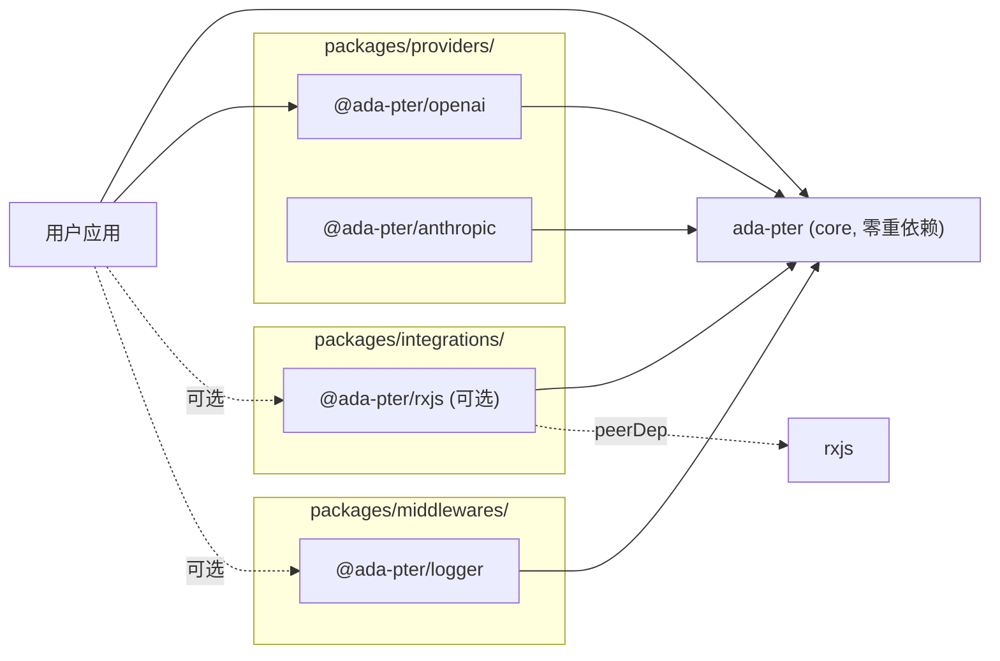
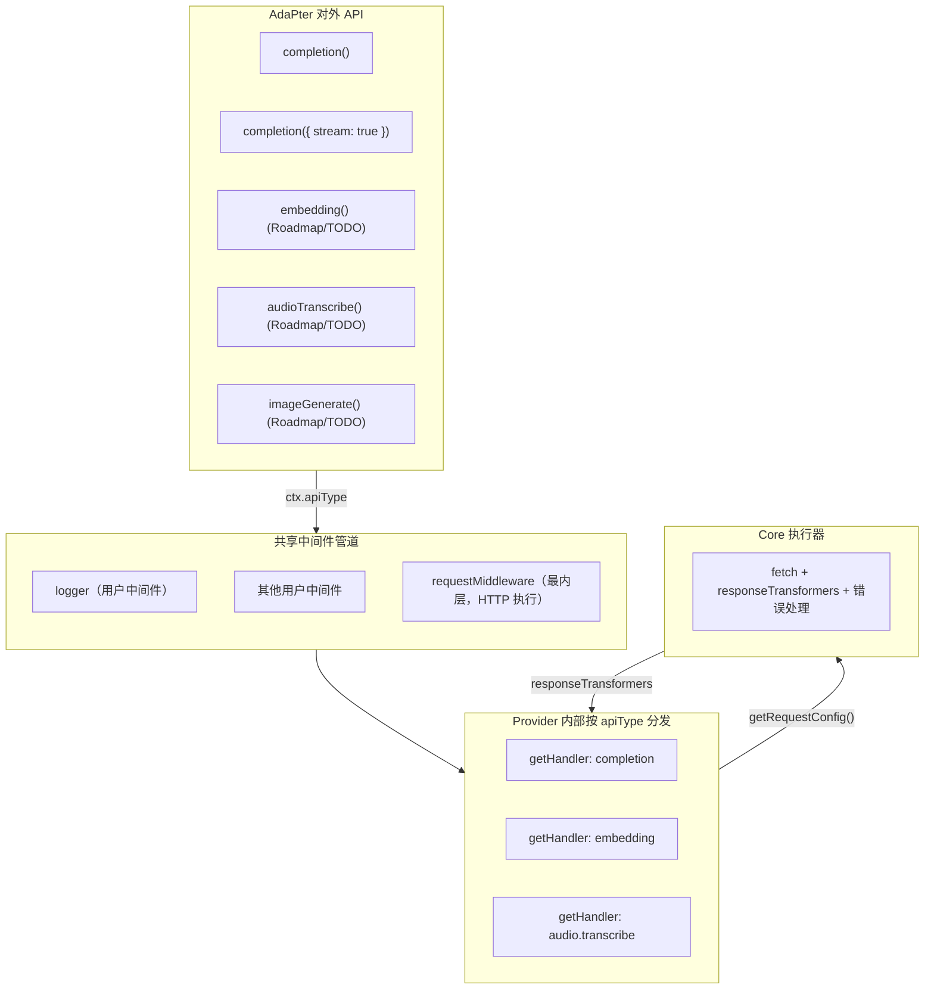
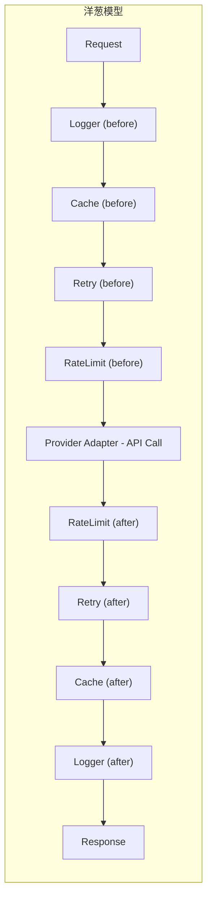

# ada-pter 统一 LLM 适配层架构方案

## 一、定位与核心理念

**一句话**：TypeScript 版的 litellm，以中间件框架为核心，Provider 以插件形式按需安装。

**核心理念**：

- **框架 + 插件**：core 是一个 Koa 式中间件引擎；每个 LLM Provider 是一个独立 npm 包
- **洋葱模型**：请求/响应流经中间件栈，支持缓存短路、重试、日志等横切关注点
- **类型优先**：充分利用 TypeScript 类型系统提供安全的 API
- **全平台**：Node.js / Browser / Deno / Bun / Edge Runtime 均可运行
- **零重依赖 core**：核心包仅使用原生 API（Promise、AsyncIterable、AbortController），RxJS 等增强能力通过可选包提供
- **多 API 类型**：统一支持 completion、embedding、audio、image 等多种 LLM API，共享同一个中间件管道

---

## 二、包结构与命名

使用 **Bun workspaces** 管理 monorepo，各包独立发布，适配器之间零耦合。

**命名规则**：核心包发布为 `ada-pter`，其他包发布为 `@ada-pter/xxx`。

**目录按职责分类**：providers（Provider 适配器）、integrations（可选集成）、middlewares（独立中间件包）各自归入子目录。

```
ada-pter/
├── packages/
│   ├── ada-pter/              # npm: ada-pter          - 核心框架（中间件引擎 + 类型 + 工具函数）
│   ├── providers/
│   │   ├── openai/            # npm: @ada-pter/openai   - OpenAI 适配器
│   │   └── anthropic/         # npm: @ada-pter/anthropic - Anthropic 适配器（后续版本）
│   ├── integrations/
│   │   └── rxjs/              # npm: @ada-pter/rxjs     - RxJS 可选集成
│   └── middlewares/
│       └── logger/            # npm: @ada-pter/logger   - 日志中间件（独立包）
├── examples/
├── biome.json             # Biome 代码规范配置
├── tsconfig.base.json
└── package.json           # workspaces 配置
```

根 `package.json` workspaces 配置：

```json
"workspaces": [
  "packages/ada-pter",
  "packages/providers/*",
  "packages/integrations/*",
  "packages/middlewares/*"
]
```

Bun workspace 的 glob 只匹配含 `package.json` 的目录，`providers/`、`integrations/`、`middlewares/` 目录本身没有 `package.json`，会被自动跳过，不会有问题。

**依赖关系图**（单向，无循环）：




**类比业界命名**：

- `hono` + `@hono/zod-validator`
- `fastify` + `@fastify/cors`
- `vite` + `@vitejs/plugin-react`

---

## 三、核心架构设计

### 3.1 整体架构




**核心分层**：

- **AdaPter 对外 API**：每个 API 类型一个类型安全的方法，内部设置 `ctx.apiType` 后交给管道。当前已实现的 API 方法：`completion`、`embedding`、`image.generation`、`transcription`、`speech`，以及 OpenAI "Responses" 系列（`response.create/retrieve/cancel/delete/compact/input_items.list`）。
- **中间件管道**：完全通用，不关心 `apiType`，logger/retry/fallback 天然适用所有 API 类型
- **Provider（纯对象）**：根据 `ctx.apiType` 找到对应 handler，提供 `getRequestConfig()` 与 `responseTransformers`
- **Core 执行器**：拿到 `ctx.request` 执行 fetch，并执行 response transformer pipeline（JSON/SSE/auto）（已完成）
- **Roadmap/TODO**：OpenAI 其他接口（如 files/threads）以及上述新 API 类型的非 OpenAI provider

core 零重依赖：Promise、AsyncIterable、AbortController、fetch。RxJS 通过 `@ada-pter/rxjs` 可选增强。

### 3.2 中间件引擎（洋葱模型）

经典 Koa compose，~20 行代码：

```typescript
function compose(middlewares: Middleware[]) {
  return (ctx: AdapterContext) => {
    let index = -1;
    function dispatch(i: number): Promise<void> {
      if (i <= index) throw new Error('next() called multiple times');
      index = i;
      const fn = middlewares[i];
      if (!fn) return Promise.resolve();
      return fn(ctx, () => dispatch(i + 1));
    }
    return dispatch(0);
  };
}
```

> retry 将内嵌在 request 中间件（executor 层），fallback 在 `adapter.execute()` 外层循环。两者均不需要中间件多次调用 `next()`，因此保留 Koa 安全检查以防止用户中间件误用。

**洋葱模型请求流**：




**错误处理**：try/catch 包裹 `await next()` 即可捕获所有下游错误，直观自然：

```typescript
const errorHandler: Middleware = async (ctx, next) => {
  try {
    await next();
  } catch (error) {
    ctx.error = error;
    // 统一错误处理逻辑
  }
};
```

### 3.3 核心类型定义

```typescript
// ===== API 类型 =====
type ApiType = 'completion' | (string & {});  // 允许自定义扩展

// ===== Context - 请求上下文 =====
interface AdapterContext {
  /** 当前调用的 API 类型 */
  apiType: ApiType;

  /** 统一配置（框架行为 + API 参数），三层 merge：global > api-level > call-level */
  config: AdapterConfig;

  /** HTTP 请求配置（url + RequestInit），由 handler.getRequestConfig() 构建，中间件可修改 */
  request: RequestConfig;

  /** 响应容器：raw Response + transformed data（由 responseTransformers 填充） */
  response: AdapterResponse;

  // ── model 解析结果（由 createContext 解析 model 字符串后填充，中间件运行前即就绪） ──
  /** 用户传入的完整 model 字符串，如 "openai/gpt-4" 或 "gpt-4" */
  modelId?: string;
  /** 从 modelId 中解析出的 provider 前缀，如 "openai"；无前缀时为 undefined */
  providerKey?: string;
  /** 从 modelId 中解析出的 modelName（去前缀），如 "gpt-4" */
  model?: string;

  // ── 路由解析结果（由 createContext 路由匹配后填充，中间件运行前即就绪） ──
  /** 最终匹配到的 Provider 对象 */
  provider?: Provider;
  /** 最终匹配到的 ApiHandler（= provider.getHandler(ctx)） */
  handler?: ApiHandler;

  /** 取消信号（timeout + 用户 signal 合并后） */
  signal?: AbortSignal;
  /** 自定义状态（类似 Koa 的 ctx.state） */
  state: Record<string, unknown>;
  /** 元信息 */
  startTime?: number;
  endTime?: number;
  error?: Error;
}

// ===== Middleware =====
type Next = () => Promise<void>;
type Middleware = (ctx: AdapterContext, next: Next) => Promise<void>;

// ===== 路由类型 =====
/** 单项匹配类型 */
type MatchPattern = string | RegExp | (string | RegExp)[] | ((value: string) => boolean);

/** 路由条件：三个字段互斥，有且只能有一个 */
type RouteCondition =
  | { modelId: MatchPattern }       // 匹配完整 model 字符串
  | { model: MatchPattern }         // 匹配 modelName（去前缀后）
  | { provider: MatchPattern } // 匹配 provider 前缀

type RouteResolver = (ctx: AdapterContext) => Provider | null | undefined;
```

### 3.4 Provider 接口（已完成：getRequestConfig + responseTransformers）

Provider 只需要提供两件事：

- 如何构建请求（`handler.getRequestConfig(ctx)` → `RequestConfig(url + RequestInit)`）
- 如何处理响应（`handler.responseTransformers`：JSON/SSE/自定义映射等）

**Provider 是纯配置对象（不是中间件）**：`defineProvider()` 返回 `Provider` 对象，通过 `adapter.route()` 注册到路由链。

```typescript
interface Provider {
  name: string;
  getHandler(ctx: AdapterContext): ApiHandler | null;
}

type ResponseTransformer = (ctx: AdapterContext) => Promise<void>;

interface ApiHandler {
  getRequestConfig(ctx: AdapterContext): RequestConfig;
  responseTransformers: ResponseTransformer[];
}
```

**`getHandler()` 取代 `handlers` 静态映射**：

旧设计中 `handlers: Partial<Record<ApiType, ApiHandler>>` 是静态映射表，新设计使用 `getHandler(ctx)` 函数，Provider 根据 `ctx.apiType`、`ctx.model` 等上下文动态返回 handler。

- 返回 `ApiHandler` → provider 可以处理
- 返回 `null` → provider 无法处理此 (apiType, model) 组合
- **route() 命中时**：getHandler 返回 null → 抛出 UnsupportedApiError（配置错误）
- **autoRoute() 时**：getHandler 返回 null → 跳过，尝试下一个 provider

设计优势：
- **model-handler 兼容性内聚**：gpt-4 只能用 completion、text-embedding 只能用 embedding，逻辑封装在 provider 内部
- **外部透明**：route/autoRoute 只看到"能处理"或"不能处理"
- **ApiHandler 保持纯粹**：只负责"怎么调 API"，不负责"能不能处理"

### 3.5 Core 执行器（已完成：fetch + transformer pipeline）

执行器依赖 `createContext()` 在中间件运行前填充：

- `ctx.provider` / `ctx.handler`
- `ctx.request`（由 `handler.getRequestConfig()` 生成并合并）

```typescript
// 以当前实现为准：createContext() 先构造 ctx.request；request middleware 执行 fetch()
// 并将 raw Response 写入 ctx.response.raw，然后执行 responseTransformers 将结果写入 ctx.response.data。
```

**统一执行器带来的好处**：

- 统一错误处理：4xx/5xx/网络错误 → 类型化 Error
- 统一 SSE 解析：通过 `sseTransformer` 将 SSE data 解析为 `AsyncIterable`
- 统一超时入口：`timeout/signal` 字段已在配置类型中定义（执行器接入仍在 Roadmap）
- 降低 Provider 开发门槛：只需关心 URL、headers、转换
- 易于测试：mock 一个点即可

### 3.6 AdaPter 核心类（已完成：多 API + stream overload）

每个 API 类型对外一个类型安全的方法，内部统一走 `execute(apiType, params)` → 共享管道。

```typescript
class AdaPter {
  private middlewares: Middleware[] = [];
  private routeEntries: RouteEntry[] = [];
  private globalConfig: AdapterConfig = {};
  private apiConfigs: Map<string, Partial<AdapterConfig>> = new Map();

  // ========== 中间件注册（仅接受函数） ==========

  /** 注册中间件 */
  use(middleware: Middleware): this;

  // ========== 路由链 ==========

  /** 条件路由：condition 匹配时，使用指定 provider */
  route(condition: RouteCondition, provider: Provider): this;
  /** 函数路由：自定义逻辑，返回 provider 或 null（跳过） */
  route(resolver: RouteResolver): this;
  /** 注入 auto-load 路由（作为路由链尾部的兜底） */
  autoRoute(): this;

  // ========== 统一配置 ==========

  /** 全局配置 */
  configure(config: AdapterConfig): this;
  /** 接口级配置 */
  configure(apiType: ApiType, config: Partial<AdapterConfig>): this;

  // ========== 对外 API ==========

  completion(params: CompletionRequest): Promise<CompletionResponse>;
  completion(params: CompletionRequest & { stream: true }): AsyncIterable<CompletionChunk>;

  embedding(params: EmbeddingRequest): Promise<EmbeddingResponse>;

  imageGeneration(params: ImageGenerationRequest & { stream: true }): AsyncIterable<ImageGenerationStreamChunk>;
  imageGeneration(params: ImageGenerationRequest & { stream?: false | undefined }): Promise<ImageGenerationResponse>;

  transcription(params: TranscriptionRequest & { stream: true }): AsyncIterable<TranscriptionStreamChunk>;
  transcription(params: TranscriptionRequest & { stream?: false | null | undefined }): Promise<TranscriptionResponse>;

  speech(params: SpeechRequest & { stream: true }): AsyncIterable<SpeechStreamChunk>;
  speech(params: SpeechRequest & { stream?: false | undefined }): Promise<SpeechResponse>;

  createResponse(params: ResponseCreateRequest & { stream: true }): AsyncIterable<ResponseCreateStreamChunk>;
  createResponse(params: ResponseCreateRequest & { stream?: false | undefined }): Promise<ResponseCreateResponse>;
  cancelResponse(params: ResponseCancelRequest): Promise<ResponseCancelResult>;
  deleteResponse(params: ResponseDeleteRequest): Promise<ResponseDeleteResult>;
  compactResponse(params: ResponseCompactRequest): Promise<ResponseCompactResult>;
  retrieveResponse(params: ResponseRetrieveRequest & { stream: true }): AsyncIterable<ResponseRetrieveStreamChunk>;
  retrieveResponse(params: ResponseRetrieveRequest & { stream?: false | undefined }): Promise<ResponseRetrieveResponse>;
  listResponseInputItems(params: ResponseInputItemsListRequest): Promise<ResponseInputItemsListResponse>;

  // ========== 内部执行流程 ==========

  /**
   * 所有对外方法最终都调这里。
   *
   * 流程：
   * 1. resolveConfig(): 三级配置合并，只做一次
   * 2. 从 resolveConfig() 结果中拿到 models 数组
   * 3. fallback 循环：for (model of models)
   *    a. createContext(): 为当前 model 创建完全解析好的 ctx（含路由匹配）
   *    b. buildPipeline() + compose(): 运行 [用户中间件, requestMiddleware]
   *    c. 成功 → return；失败 → onFallback → 下一个 model
   * 4. 全部失败 → throw lastError
   */
  private async execute<TRes>(apiType: ApiType, params: Record<string, unknown>): Promise<TRes> {
    const { config, models } = this.resolveConfig(apiType, params);

    let lastError: Error | undefined;
    for (let i = 0; i < models.length; i++) {
      try {
        const ctx = await this.createContext(apiType, config, models[i]);
        await compose(this.buildPipeline())(ctx);
        return ctx.response as TRes;
      } catch (err) {
        lastError = err as Error;
        if (i < models.length - 1) {
          config.onFallback?.(lastError, models[i], models[i + 1]);
          continue;
        }
      }
    }
    throw lastError!;
  }

  /** 三级配置合并并返回 model 列表（当前实现中包含 models 提取） */
  private resolveConfig(apiType, params): { config: AdapterConfig; models: string[] };

  /**
   * 为单个 model 创建完全解析好的 ctx（async）。
   * 1. parseModelId → modelId, providerKey, model
   * 2. resolveFromRouteChain → provider, handler
   * ctx 出来时所有字段已就绪，用户中间件在请求发出前即可读取。
   */
  private async createContext(apiType, config, model): Promise<AdapterContext>;

  /** 构建管道：[...用户中间件, createRequestMiddleware()] */
  private buildPipeline(): Middleware[];
}

// 内置单例
export const adapter = new AdaPter();

// 工厂函数
export function createAdapter(): AdaPter {
  return new AdaPter();
}
```

**关键变更（当前代码）**：
- `use()` 仅注册中间件（函数），不再接受 Provider 对象
- Provider 路由通过 `route()` 管理，支持条件路由和函数路由
- `autoRoute()` 将 auto-load 逻辑插入路由链尾部
- `configure()` 合并了原 `configure()` + `defaults()`，通过重载区分全局配置和接口级配置
- `model` 作为配置参数，支持三级合并
- **`execute()` 承担 fallback 循环**：config 只 resolve 一次，每个 model 独立创建 ctx + 运行完整中间件管道
- **`createContext()` 是 async**：负责 model 解析 + 路由匹配，ctx 出来时 provider/handler 已就绪
- **用户中间件可在请求前读取完整上下文**：`ctx.provider`、`ctx.handler`、`ctx.modelId` 等在中间件运行前即已填充
- **最内层中间件是 `createRequestMiddleware()`**：只负责 HTTP 执行，替代原 dispatch 中间件
- **多 API 面上线**：completion、embedding、image generation、transcription、speech，以及 OpenAI Responses 系列

### 3.7 Retry 与 Fallback（当前实现 + 规划）

> fallback 已实现于 `adapter.execute()` 外层循环（每个 model 独立创建 ctx + 运行完整中间件管道）。retry 字段（`maxRetries/retryDelay`）已在配置类型中预留，但 request 层重试逻辑尚未接入。

**Retry（Roadmap）**：

当前代码尚未包含上述重试循环，后续会在 request middleware 层补齐（仅重试 HTTP 请求，不重跑中间件链）。

**Fallback -- adapter.execute() 外层循环**（model 失败后自动切换，每个 model 重跑完整中间件管道）：

`model` 支持传数组作为 fallback 链，替代原 `fallbackModels` 字段（已实现）：

```typescript
// 在 adapter.execute() 内部
const { config, models } = this.resolveConfig(apiType, params);  // config 只 resolve 一次

let lastError: Error | undefined;
for (let i = 0; i < models.length; i++) {
  try {
    // 每个 model 独立创建 ctx（含 model 解析 + 路由匹配）
    const ctx = await this.createContext(apiType, config, models[i]);
    // 运行完整中间件管道（用户中间件 + requestMiddleware）
    await compose(this.buildPipeline())(ctx);
    return ctx.response;
  } catch (err) {
    lastError = err as Error;
    if (i < models.length - 1) {
      config.onFallback?.(lastError, models[i], models[i + 1]);
      continue;
    }
  }
}
throw lastError!;
```

**分层设计的优势**：
- retry 仅重试 HTTP 请求（在 request 中间件内），不浪费中间件链的重复执行
- fallback 每个 model 独立创建 ctx + 运行完整中间件管道，不存在状态污染
- 用户中间件可感知每个 fallback 尝试（如日志、计费），比原设计（不重跑中间件）更灵活
- ctx.provider / ctx.handler 在中间件运行前即已就绪，中间件可基于 provider 做差异化逻辑
- compose 保留 Koa 安全检查（无需支持多次 `next()`）
- 配置通过三级合并（全局/接口级/调用级），使用方式统一

### 3.8 `@ada-pter/rxjs`（可选增强包）

为需要 RxJS 能力的用户提供无缝集成：

```typescript
// @ada-pter/rxjs
import { Observable } from 'rxjs';
import type { AdaPter, CompletionRequest, StreamChunk } from 'ada-pter';

/** AsyncIterable → Observable 转换 */
export function toObservable<T>(iterable: AsyncIterable<T>): Observable<T> {
  return new Observable(subscriber => {
    (async () => {
      try {
        for await (const item of iterable) {
          if (subscriber.closed) break;
          subscriber.next(item);
        }
        subscriber.complete();
      } catch (err) {
        subscriber.error(err);
      }
    })();
  });
}

/** 为 adapter 添加 completion$() 方法 */
export function withRxJS(adapter: AdaPter) {
  return {
    ...adapter,
    completion$(params: CompletionRequest): Observable<StreamChunk> {
      return toObservable(adapter.completion({ ...params, stream: true }));
    },
  };
}
```

使用方式：

```typescript
import { createAdapter } from 'ada-pter';
import { openai } from '@ada-pter/openai';
import { withRxJS } from '@ada-pter/rxjs';
import { map, scan } from 'rxjs/operators';

const adapter = withRxJS(
  createAdapter()
    .route({ provider: 'openai' }, openai({ apiKey: '...' }))
);

// 原生方式仍然可用
const res = await adapter.completion({ model: 'openai/gpt-4', messages });

// RxJS 增强
adapter.completion$({ model: 'openai/gpt-4', messages }).pipe(
  map(chunk => chunk.content),
  scan((acc, c) => acc + c, ''),
).subscribe(text => console.log(text));
```

### 3.9 Provider 插件示例（`@ada-pter/openai` 当前状态）

当前仓库内 `packages/providers/openai` 已实现：

- completion（流式 + 非流式）
- embedding
- images
- transcription
- speech
- OpenAI Responses 系列（`response.create/retrieve/cancel/delete/compact/input_items.list`），含需要的流式返回

`autoProvider.getHandler(ctx)` 按 `ctx.apiType` 分发，非流式用 `jsonTransformer`，流式用 `sseTransformer`（上游支持流时）。

---

## 四、用户使用方式

### 4.1 使用内置单例（最简方式）

核心包导出一个预创建的 `adapter` 单例，结合 `autoRoute()` + 环境变量，可零配置直接调用：

```typescript
import { adapter } from 'ada-pter';

// 零配置：启用 autoRoute + 环境变量提供 API Key
adapter.autoRoute();

const res = await adapter.completion({
  model: 'openai/gpt-4',
  messages: [{ role: 'user', content: '你好' }],
});

// 流式
for await (const chunk of adapter.completion({
  model: 'openai/gpt-4',
  messages: [{ role: 'user', content: '你好' }],
  stream: true,
})) {
  process.stdout.write(chunk.content ?? '');
}
```

需要定制时，通过 `configure()` 设置全局和接口级配置：

```typescript
import { adapter } from 'ada-pter';

// 全局配置
adapter.configure({
  timeout: 30_000,
  maxRetries: 3,
});

// 接口级配置（使用 configure 重载）
adapter.configure('completion', { model: 'gpt-4', temperature: 0.9 });

// 调用时可以不传 model（使用接口级配置的 model: 'gpt-4'）
const res = await adapter.completion({
  messages: [{ role: 'user', content: '你好' }],
  temperature: 0.2,   // 调用级覆盖接口级 0.9
});
```

单例上也可以 `use()` 中间件和 `route()` 注册 Provider，与自定义实例用法完全一致。

### 4.2 自定义实例（含三级配置）

需要多实例隔离（如不同 API Key、不同中间件栈）时，使用 `createAdapter()` 创建独立实例：

```typescript
import { createAdapter } from 'ada-pter';
import { openai } from '@ada-pter/openai';
import { anthropic } from '@ada-pter/anthropic';

const openaiProvider = openai({ apiKey: process.env.OPENAI_API_KEY! });
const anthropicProvider = anthropic({ apiKey: process.env.ANTHROPIC_API_KEY! });

// 第 1 级：全局配置
const myAdapter = createAdapter().configure({ timeout: 30_000, maxRetries: 3 })
  // 路由链
  .route({ provider: 'openai' }, openaiProvider)
  .route({ provider: 'anthropic' }, anthropicProvider)
  .route({ model: /^(gpt-|o[0-9])/ }, openaiProvider)
  .route({ model: /^claude-/ }, anthropicProvider)
  .autoRoute();

// 第 2 级：接口级配置
myAdapter.configure('completion', { model: 'gpt-4', temperature: 0.9 });

// 第 3 级：调用级配置（最高优先级）
const res = await myAdapter.completion({
  // model 不传，使用接口级配置的 'gpt-4'
  messages: [{ role: 'user', content: '你好' }],
  temperature: 0.2,        // 覆盖接口级 0.9
  timeout: 60_000,         // 覆盖全局 30_000
});

// 目前仅 completion 已实现；embedding/audio/image 仍在 Roadmap

// 调用级覆盖 model（包括 fallback 链）
const res2 = await myAdapter.completion({
  model: ['gpt-4', 'claude-3-opus'],  // 数组 = fallback 链
  messages: [{ role: 'user', content: '你好' }],
});
```

> `adapter` 单例和 `createAdapter()` 创建的实例是**同一个 `AdaPter` 类**，API 完全一致。单例是便捷入口，自定义实例用于多实例隔离。

### 4.3 使用中间件 + Retry + Fallback

```typescript
import { createAdapter } from 'ada-pter';
import { openai } from '@ada-pter/openai';
import { anthropic } from '@ada-pter/anthropic';
import { logger } from '@ada-pter/logger';

const openaiProvider = openai({ apiKey: '...' });
const anthropicProvider = anthropic({ apiKey: '...' });

const adapter = createAdapter().configure({
  maxRetries: 3,         // 重试参数（当前为预留字段，执行器尚未接入）
  retryDelay: 1000,
})
  .use(logger())                                              // 中间件
  .route({ model: /^(gpt-|o[0-9])/ }, openaiProvider)        // 路由
  .route({ model: /^claude-/ }, anthropicProvider)
  .autoRoute();

// fallback 通过 model 数组实现
const res = await adapter.completion({
  model: ['openai/gpt-4', 'anthropic/claude-3-opus', 'openai/gpt-3.5-turbo'],
  messages: [{ role: 'user', content: '你好' }],
  onFallback: (err, from, to) => console.warn(`${from} → ${to}`),
});
```

### 4.4 Fallback（多模型故障转移）

model 数组替代原 `fallbackModels`，语义更清晰：

```typescript
import { createAdapter } from 'ada-pter';
import { openai } from '@ada-pter/openai';
import { anthropic } from '@ada-pter/anthropic';

const adapter = createAdapter().configure({ maxRetries: 3 })
  .route({ provider: 'openai' }, openai({ apiKey: '...' }))
  .route({ provider: 'anthropic' }, anthropic({ apiKey: '...' }))
  .autoRoute();

// model 数组 = fallback 链，当前模型失败后自动尝试下一个
const res = await adapter.completion({
  model: ['openai/gpt-4', 'anthropic/claude-3-opus', 'openai/gpt-3.5-turbo'],
  messages: [{ role: 'user', content: '你好' }],
  onFallback: (error, from, to) => console.warn(`${from} failed → ${to}`),
});

// 也可在接口级配置 fallback 链
adapter.configure('completion', {
  model: ['openai/gpt-4', 'anthropic/claude-3-opus'],
});
```

### 4.5 自定义中间件

```typescript
import type { Middleware } from 'ada-pter';

// 对所有 API 类型生效
const costTracker: Middleware = async (ctx, next) => {
  await next();
  if (ctx.response?.usage) {
    console.log(`[${ctx.apiType}] Tokens: ${ctx.response.usage.total_tokens}`);
  }
};

// 只对特定 API 类型生效
const embeddingCache: Middleware = async (ctx, next) => {
  if (ctx.apiType !== 'embedding') return next();
  const cached = myCache.get(ctx.request.input);
  if (cached) { ctx.response = cached; return; }
  await next();
  myCache.set(ctx.request.input, ctx.response);
};

adapter.use(costTracker);
adapter.use(embeddingCache);
```

### 4.6 自定义 Provider（无需发包）

```typescript
import { createAdapter, defineProvider } from 'ada-pter';

const myLLM = defineProvider({
  name: 'my-llm',
  getHandler(ctx) {
    if (ctx.apiType === 'completion') {
      return {
        getRequestConfig(ctx) {
          return {
            url: 'https://my-api.com/v1/chat',
            method: 'POST',
            headers: { 'Content-Type': 'application/json', 'Authorization': 'Bearer xxx' },
            body: { prompt: ctx.config.messages },
          };
        },
        responseTransformers: [],
      };
    }
    return null;
  },
});

const adapter = createAdapter()
  .route({ model: /^my-model-/ }, myLLM)
  .autoRoute();
```

### 4.7 Provider 自动加载（零注册使用）

通过 `autoRoute()` 启用自动加载。用户安装 `@ada-pter/openai` 后，无需手动 `import` 和 `route()` 注册，框架根据请求模型名称自动动态导入并注册对应的 Provider 包：

```typescript
import { adapter } from 'ada-pter';

adapter.autoRoute();  // 启用自动加载（插入路由链尾部）

// 方式一：带前缀（前缀路由推断）
const res1 = await adapter.completion({
  model: 'openai/gpt-4',         // 解析 "openai" 前缀 → import('@ada-pter/openai')
  messages: [{ role: 'user', content: '你好' }],
});

// 方式二：不带前缀（内置模型映射表推断）
const res2 = await adapter.completion({
  model: 'gpt-4o',               // inferProvider("gpt-4o") → "openai" → import('@ada-pter/openai')
  messages: [{ role: 'user', content: '你好' }],
});
```

也支持集中配置模式（覆盖环境变量）：

```typescript
const adapter = createAdapter().configure({
}).autoRoute();

// 无需 route()，Provider 在首次请求时自动加载
const res = await adapter.completion({
  model: 'gpt-4o',
  messages: [{ role: 'user', content: '你好' }],
});
```

**注意**：用户仍需 `npm install @ada-pter/openai`（动态 import 不能加载未安装的包）。`autoRoute()` 作为路由链的尾部兜底，前面的 `route()` 优先匹配。autoRoute 内部通过包内导出的 `autoProvider` 获取 Provider，并用 `getHandler()` 判断兼容性。

> 自动加载的完整实现细节见[核心包实现方案](./ada-pter核心包实现方案.md)。

### 4.8 可选 RxJS 增强

```typescript
import { createAdapter } from 'ada-pter';
import { openai } from '@ada-pter/openai';
import { withRxJS } from '@ada-pter/rxjs';
import { map, filter, scan } from 'rxjs/operators';

const adapter = withRxJS(
  createAdapter().route({ provider: 'openai' }, openai({ apiKey: '...' }))
);

// 新增 completion$() 方法
adapter.completion$({
  model: 'openai/gpt-4',
  messages: [{ role: 'user', content: '写一首诗' }],
}).pipe(
  map(chunk => chunk.content),
  filter(Boolean),
  scan((acc, content) => acc + content, ''),
).subscribe(fullText => console.log(fullText));
```

---

## 五、关键技术决策

### 5.1 core 零重依赖

- core（`ada-pter`）仅使用原生 API：Promise、AsyncIterable、AbortController、fetch（由 Provider 插件使用）
- 没有 RxJS、没有 axios，极致轻量
- fallback 在 adapter.execute() 外层循环（每个 model 独立创建 ctx + 运行完整中间件管道）
- retry 参数（`maxRetries/retryDelay`）已定义在配置类型，request 层执行逻辑仍在 Roadmap
- 核心包不导出任何中间件。logger 外置为独立包 `@ada-pter/logger`
- RxJS 通过可选的 `@ada-pter/rxjs` 包提供（peerDep: rxjs）

### 5.2 网络请求：Core 统一执行 + fetch（方案 C）

- **已完成**：Core 统一处理 fetch、错误处理、以及 response transformers
- **已完成**：Provider 的 ApiHandler 通过 `getRequestConfig()` 声明请求，通过 `responseTransformers` 声明响应处理
- 使用原生 fetch（Node.js 18+、浏览器、Deno、Bun、Edge Runtime）
- core 提供 `sseTransformer`（将 SSE data 解析为 `AsyncIterable`）
- Provider 也可提供自定义 transformer（如将 provider-specific 数据映射到统一 chunk）

### 5.3 流式响应：AsyncIterable

- core 用 `AsyncIterable<StreamChunk>` 作为流式响应的统一类型
- 原生 JS，零依赖，全平台兼容
- 用户使用 `for await...of` 消费，无需学习额外 API
- 需要 RxJS 时，`@ada-pter/rxjs` 的 `toObservable()` 一行转换

#### 5.3.1 流式场景的中间件语义（请求级 vs 结果级）

由于流式响应采用 `AsyncIterable`，**中间件管道本身只负责“建立流/挂载流”**，并不会在管道内把 stream 消费完：

- `completion({ stream: true })` 内部运行一次完整中间件管道（onion），最终由最内层 requestMiddleware 负责发起请求并设置 `ctx.response.data` 为 `AsyncIterable`
- 管道 `await next()` 返回时，语义是 **“ctx.response.data 已就绪（或错误已抛出）”**，而不是 “stream 已读完”
- 真正的逐 chunk 消费发生在用户侧 `for await...of`（或下游把 `AsyncIterable` 转成别的抽象时）

因此我们将中间件能力明确拆分为三类：

- **请求级（request-level）中间件**：只关心请求生命周期（发请求前、拿到响应头/建立 stream 后），例如鉴权、路由选择、限流、打点 TTFB、记录请求参数、设置 `ctx.signal`、决定是否短路等。它们的“后处理”（`await next()` 之后）**不需要等待 stream 结束**。
- **结果级（result-level / stream-end）后处理**：需要在**流完全结束**后执行的逻辑，例如计费结算、完整输出审计、总 tokens 统计、最终耗时/状态写入日志/埋点、清理资源等。
- **chunk 级（per-chunk）处理（可选）**：仅在确实需要逐 chunk 变换/过滤/统计时才做，例如脱敏、过滤 heartbeat、统一 chunk 格式化、实时指标统计等。

##### 5.3.1.1 结果级后处理的推荐模式：wrap `ctx.response.data`

要实现“stream 结束后再执行后处理”，不应让中间件链 per-chunk 重跑（开销大且 onion 语义不自然），而是让需要结果级语义的中间件在 `await next()` 之后**包裹** `ctx.response.data`：

```ts
import type { Middleware } from "ada-pter";

/**
 * 结果级后处理示例：
 * - A 的前处理/后处理属于请求级（建立 stream 前后）
 * - A 通过 wrapper 的 finally 实现“stream 结束后”逻辑
 */
const middlewareA: Middleware = async (ctx, next) => {
  const start = Date.now();
  await next();

  const inner = ctx.response.data as AsyncIterable<unknown> | undefined;
  if (!inner) return;

  ctx.response.data = (async function* () {
    try {
      for await (const chunk of inner) {
        // 可选：per-chunk 处理（不需要就直接 yield）
        yield chunk;
      }
    } finally {
      // 结果级后处理：只有当用户把流读完/提前停止/抛错/取消时才会触发
      const elapsed = Date.now() - start;
      ctx.state.streamElapsedMs = elapsed;
      // ... 计费/日志/清理 ...
    }
  })();
};
```

##### 5.3.1.2 为什么“请求级”中间件不会被“结果级”阻塞？

假设中间件 B 是请求级后处理（例如记录“stream 已建立”），A 是结果级（通过 wrapper 在流结束时结算）：

- 中间件管道运行时，A/B 的 `await next()` 只会等待**最内层把 `ctx.response.data` 设置好**（建立流），不会等待用户把流消费完
- A 的逐 chunk 处理发生在用户侧消费 `ctx.response.data` 时，因此不会让 B 的后处理“卡住”
- 换句话说：A 的 wrapper 是把后处理“挂到 stream 的生命周期上”，而不是把中间件管道的生命周期拉长

##### 5.3.1.3 多个中间件同时 wrap 时的顺序与语义

多个中间件都可能在 `await next()` 后 wrap `ctx.response.data`。在经典 onion 回溯顺序下：

- **越靠近 requestMiddleware 的中间件，越先执行它的 after 部分**，因此它会更早地拿到并 wrap 当时的 `ctx.response.data`
- 外层中间件随后会再 wrap 一次（wrap 之前已经被内层 wrap 过的 stream）
- 最终用户拿到的是“多层 wrapper 叠加”的 `AsyncIterable`；每层 wrapper 都可以有自己的 per-chunk 逻辑和 `finally` 收尾

> 实践建议：**请求级**逻辑（如“记录建立流”）放在 `await next()` 后立即执行；**结果级**逻辑放到 wrapper 的 `finally`；避免把“必须等流结束”的逻辑写在普通 after 中（那样会产生语义误解）。

### 5.4 Config 配置系统：三级合并

- **第 1 级 - 全局配置**：`adapter.configure({ timeout, maxRetries, model, ... })` 或 `createAdapter().configure({ ... })`
- **第 2 级 - 接口级配置**：`adapter.configure('completion', { model: 'gpt-4', temperature: 0.9 })`
- **第 3 级 - 调用级配置**：每次调用时传入，最高优先级
- 合并策略：调用级 > 接口级 > 全局级，深合并
- 合并后注入 `ctx.config`，中间件可读取和修改
- `configure()` 通过重载合并了原 `configure()` + `defaults()` 双方法
- `model` 为配置参数，支持三级解析：
  - `model` 可以是 string 或 string[]（数组 = fallback 链），替代原 `fallbackModels` 字段
- 不需要配置文件：ada-pter 是库不是 CLI 工具

### 5.5 多 API 类型：共享管道 + 按类型分发

- AdaPter 对外为每个 API 类型提供类型安全的方法（completion / embedding / audioTranscribe ...）
- 内部统一走 `execute(apiType, params)` → 共享中间件管道 → Provider 按 `ctx.apiType` 分发到对应 handler
- 中间件天然通用：logger/retry/fallback 无需任何修改即适用所有 API 类型
- Provider 只实现它支持的 handler，不支持的抛 `UnsupportedApiError`
- 新增 API 类型只需：在 AdaPter 加方法 + Provider 加 handler，中间件和执行器零改动

### 5.6 ESM-only 输出

- 所有包仅输出 ESM 格式（`.js` + `.d.ts`），不生成 CJS（`.cjs`）
- ada-pter 要求 Node.js 18+（因为原生 fetch），该版本对 ESM 支持已完全成熟
- 业界趋势：chalk v5、execa v6、got v12、node-fetch v3 等知名包均已 ESM-only
- Bun / Deno 天然 ESM-first，无需 CJS 兼容
- 简化构建配置和 package.json exports，避免 CJS/ESM 互操作的各种边界问题
- CJS 项目仍可通过 `await import('ada-pter')` 使用（Node.js 12.17+ 支持 CJS 中的动态 `import()`）

### 5.7 Provider 自动加载

- 通过 `adapter.autoRoute()` 显式注入到路由链尾部，作为兜底的路由条目
- 基于模型名称推断 provider：先尝试前缀路由（如 `openai/gpt-4` → `openai`），若无前缀则通过**内置模型映射表**推断（如 `gpt-4o` → `openai`）
- 内置模型映射表维护主流模型到 provider 的映射（在 core 内维护）
- 推断出 provider 名后自动 `import('@ada-pter/' + providerName)` 加载对应包
- 使用 `getHandler(ctx)` 判断兼容性，不兼容则跳过
- API Key 获取（Roadmap/TODO）：推荐环境变量约定（如 `OPENAI_API_KEY`）；集中配置能力需由 provider 包自行实现
- 已加载的 Provider 缓存复用，仅首次请求有动态 import 延迟
- 属于路由链的最低优先级（尾部），前面的 `route()` 优先匹配
- 服务端环境（Node.js / Bun / Deno）完美支持；浏览器端由于打包器无法静态分析动态字符串 import，建议仍用显式 `route()` 方式
- 包未安装时会被记录为 failed import 并继续尝试后续路由

### 5.8 Provider 路由：route() 路由链

Provider 路由采用声明式**路由链**体系：

**解析优先级**：

1. **route() 路由链**：按注册顺序依次匹配，首个匹配即确定
2. **autoRoute()**：路由链尾部兜底，动态加载后以 `getHandler()` 判断兼容性

**route() 路由条件三字段互斥**（通过 TypeScript 联合类型强制约束）：

- `{ modelId: MatchPattern }` -- 匹配完整 model 字符串（如 "openai/gpt-4"）
- `{ model: MatchPattern }` -- 匹配去前缀后的 modelName（如 "gpt-4"）
- `{ provider: MatchPattern }` -- 匹配 provider 前缀（如 "openai"）

不允许 `{ provider: "openai", model: "gpt-4" }` 这样的组合，消除匹配歧义。如需同时约束 provider 和 model，使用 `{ modelId: /^openai\/gpt-/ }`。

**route 匹配即确定语义**：

- 条件路由匹配 → 使用该 provider → 若 `getHandler()` 返回 null → 抛出 UnsupportedApiError（配置错误，不跳过）
- 函数路由返回 provider → 同上；返回 null → 跳过到下一条 route
- autoRoute → `getHandler()` 返回 null → 跳过，尝试下一个 provider（兼容性判断）

**设计收益**：
- route 链声明式定义路由规则，顺序决定优先级
- autoRoute 作为显式插桩，用户明确知道有自动加载兜底
- `ctx.provider` 存储完整 Provider 对象，`ctx.handler` 存储匹配到的 handler，均在 `createContext()` 阶段填充，用户中间件运行前即可读取

### 5.9 构建与发布

#### Bun workspaces（Monorepo 管理）

- **极速安装**：比 pnpm/npm 快 20-30x，二进制 lockfile
- **All-in-One**：runtime + package manager + test runner + bundler
- **内置 TS 支持**：直接运行 `.ts`，无需 ts-node
- **原生 workspace**：根 `package.json` 配置 `"workspaces": ["packages/*"]`

#### tsdown（构建工具）

- **tsup 的现代继任者**：Vite/Rolldown 团队开发，Vite/Vitest 已采用
- **基于 Rolldown**：Rust 引擎，构建更快
- **ESM-only 输出**：仅输出 ESM 格式（`.js` + `.d.ts`），不生成 CJS
- **默认开启 DTS + clean**
- **从 tsup 无缝迁移**：`npx tsdown-migrate`
- **与 Bun 完全兼容**：独立 CLI，不绑定包管理器
- **各包独立配置**：`tsdown.config.ts` 配置简短（3-5 行），无需抽公共 base

#### 其他工具

- **测试**：Bun test（Bun 内置测试框架，零额外依赖，原生 TS 支持，API 类似 Jest）
- **发布**：changeset
- **代码规范**：Biome（Rust linter + formatter，替代 ESLint + Prettier）

---

## 六、第一版范围

第一版聚焦核心框架 + 1 个 Provider + 可选包，验证架构：

- `ada-pter`（核心）：中间件引擎、Context、类型、route() 路由链、三级配置 configure()、统一执行器、model 数组 fallback、autoRoute() 自动加载、内置模型映射表、defineProvider、内置单例
- `@ada-pter/openai`：completion（含 streaming）
- `@ada-pter/rxjs`：toObservable、withRxJS
- `@ada-pter/logger`：独立日志中间件包

**后续版本**：
- `@ada-pter/anthropic`：completion（含 streaming）
- 更多 Provider（azure-openai 等）
- 更多独立中间件包
- Proxy Server

---

## 七、与 litellm 的对比

- **架构**：litellm 单包大 if/elif 路由 → ada-pter 中间件框架 + 插件
- **HTTP 层**：litellm BaseLLMHTTPHandler → ada-pter 统一 request middleware + response transformers（思路一致）
- **扩展方式**：litellm 修改源码/PR → ada-pter 安装插件/自定义中间件/defineProvider
- **Provider 添加**：litellm 在 main.py 加分支 → ada-pter 独立 npm 包，声明 handlers 即可
- **多 API 类型**：litellm 每个类型独立函数 → ada-pter 共享管道 + handlers 分发
- **流式处理**：litellm CustomStreamWrapper → ada-pter AsyncIterable（+ 可选 RxJS）
- **类型安全**：litellm 运行时检查 → ada-pter 编译时类型检查
- **依赖**：litellm 依赖较重 → ada-pter core 零重依赖

